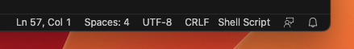
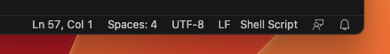

# Multiscale Run Docker Recipe

This repository provides the Docker recipe for the multiscale run project, i.e. the project that couples [Neurodamus](https://github.com/BlueBrain/neurodamus), [STEPS](https://github.com/CNS-OIST/STEPS), [AstroVascPy](https://github.com/BlueBrain/AstroVascPy) & [metabolism](https://www.epfl.ch/research/domains/bluebrain/blue-brain/people/our-people/simulation-neuroscience-division/polina-shichkova/).

## Requirements

You must have:

* [Docker](https://www.docker.com/community-edition) installed and running.
* [Docker Compose](https://docs.docker.com/compose) utility installed.
* [Git](https://git-scm.com/)

## Getting Started (MacOS & Linux)

The set of commands below will start a JupyterLab container providing
python modules for all the coupled solvers.

The image is already built and pushed in [dockerhub](https://hub.docker.com/) (named `kotsaloscv/multiscale_run:v0.0.0`).
If you want to use it as is, with no changes in the recipe, just skip the `docker-compose build` step in the instructions below.

```bash
$ git clone https://github.com/kotsaloscv/multiscale_run_dimage.git
$ cd multiscale_run_dimage
$ echo -e "DUID=$(($(id -u)+1))\nDGID=$(id -g)\nHOST=$(hostname)" > .env
$ # Skip the build step, since it is already available
$ docker-compose build
$ docker-compose up
...
multiscale_run_dimage-lab-1  | [C 2023-07-05 13:59:36.052 ServerApp] 
multiscale_run_dimage-lab-1  |     
multiscale_run_dimage-lab-1  |     To access the server, open this file in a browser:
multiscale_run_dimage-lab-1  |         file:///home/dummy/.local/share/jupyter/runtime/jpserver-29-open.html
multiscale_run_dimage-lab-1  |     Or copy and paste one of these URLs:
multiscale_run_dimage-lab-1  |         http://bb-c02dk0usml85.epfl.ch:8888/lab?token=596536b192733c7041b845a969e980e6814845132625e99e
multiscale_run_dimage-lab-1  |         http://127.0.0.1:8888/lab?token=596536b192733c7041b845a969e980e6814845132625e99e
```

Then open your web browser at the provided HTTP address. In this case
http://127.0.0.1:8888/lab?token=596536b192733c7041b845a969e980e6814845132625e99e

## Fetch Multiscale Run Project

These steps download a reduced/experimental version of multiscale run project:

* If on MacOS/Linux (**pip required**), `./setup_multiscale_run.sh`, and skip the steps below.
* Download [multiscale run](https://drive.google.com/file/d/1ZgdF4R2UgL_s8TK4lnb8qnSmhxex81gJ/view?usp=sharing) (click on the hyperlink).
* Uncompress the downloaded project under the **notebooks** folder.
* Follow the steps below to build & deploy the docker image.

## Files management

You are free to modify the `notebooks` directory from either the container or
your machine. Files created on one side will be visible on the other one, and vice versa!

## Windows support

**For Windows, the build step cannot be avoided due to the issue of the `./recipe/entrypoint` file (see below).**

This Docker image can be run with _Docker Desktop for Windows_. Instructions in the **Getting Started** section above are a bit different though. Instead of executing the command `echo -e "DUID=$(($(id -u)+1))\nDGID=$(id -g)\nHOST=$(hostname)" > .env`, update the `docker-compose.yaml` file as follows:

* **hostname**: hardcode the machine name
* **USER_LOGIN**: hardcode your user name
* **USER_ID**: 42
  * If you get an error similar to `useradd: UID 42 is not unique`, you can change this value to an other arbitrary one, e.g. 43.
* **GROUP_ID**: 42
* **volumes**: replace `$PWD` by the path to this repository.

for instance:

```diff
diff --git a/docker-compose.yml b/docker-compose.yml
index 528e993..64dcca9 100644
--- a/docker-compose.yml
+++ b/docker-compose.yml
@@ -3,15 +3,15 @@ services:
   lab:
     image: ...
     build: recipe
-    hostname: $HOST
+    hostname: my-windows10-machine
     ports:
     - "8888:8888"
     environment:
-    - USER_LOGIN=$USER
-    - USER_ID=$DUID
-    - GROUP_ID=$DGID
+    - USER_LOGIN=YOUR_USER_NAME
+    - USER_ID=42
+    - GROUP_ID=42
     volumes:
-    - $PWD/notebooks:/opt/src/notebooks
+    - C:\Users\YOUR_USER_NAME\Documents\multiscale_run_dimage\notebooks:/opt/src/notebooks
   notebook:
     extends: lab
     command:
```

Before running `docker-compose build`, it is imperative to open `./recipe/entrypoint` with Visual Code (or your favourite text editor), and change the **End of Line Sequence** from `CRLF` to `LF` (see images below).

From:


To:


Finally, run `docker-compose up`.

## Use the container without JupyterLab (for all operating systems)

If there is no need for the JupyterLab infrastructure, the image can be directly pulled from dockerhub (no need for manual build in Windows):

```bash
docker pull kotsaloscv/multiscale_run:v0.0.0
```

and, it can be executed as

```bash
docker run --rm -it kotsaloscv/multiscale_run:v0.0.0 bash
```

## Acknowledgement

The development of this software was supported by funding to the Blue Brain Project, a research center of the
École polytechnique fédérale de Lausanne (EPFL), from the Swiss government’s ETH Board of the Swiss Federal
Institutes of Technology.

Copyright (c) 2005-2023 Blue Brain Project/EPFL

## License

Apache-2.0 license (see LICENSE.txt)
